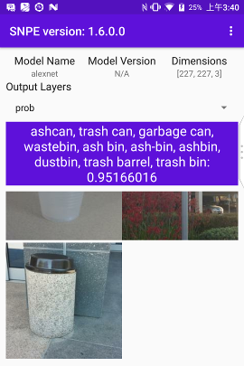

[TOC]


##Get Started with Snapdragon Neural Processing Engine

### What is SNPE
Snapdragon 神经处理引擎主要针对搭载Snapdragon的设备，在这些设备上运行训练好的神经网络时，它会做出一些优化，使神经网络表现出更好的性能。同时减少开发者花在优化上的时间。

为了实现优化效果，它提供了模型转换和执行工具（指DLC），以及针对核心，使用power和性能配置文件的API，以达到期望的用户体验。

SNPE支持`卷积神经网络`和 自定义层(custom layers)

### What's in the SDK
列出几个SDK里面比较有用的信息
* 用于执行神经网络模型的Android和Linux的运行时`runtime`
* 对高通芯片DSP/GPU/CPU的加速支持（这个属于必备的）
* 对`Caffe` `Caffe2`和`TensorFlow`模型的支持 (所以限定了需要使用caffe或者TF训练模型)
* 用于在运行时控制加载，执行和调度的API (这个应该是核心)
* 用于模型转换的桌面工具  (后面会提到的DLC)
* 瓶颈识别的性能基准(Performance benchmark for bottleneck identification, 没太理解)

> `Caffe` 与 `Tensorflow`
> 这方面推荐一篇博客：[Caffe、TensorFlow、MXnet三个开源库对比](https://chenrudan.github.io/blog/2015/11/18/comparethreeopenlib.html)
> 结合博客和我在其他论坛看到的讨论，总得来说`Caffe`是比较容易上手的，而且源码清晰，适合阅读学习，但`tensorflow`更全面，而且有谷歌的强力支持，长期来看适用面会很广。

### Development workflow

1. 训练机器学习模型，这一步就是用`Caffe`或者`tensorflow`去做
2. 把模型转换成`DLC`
3. 把NPE运行时添加到应用中
4. 在Snapdragon处理芯片上加载运行模型，根据结果分析可以继续优化训练模型

> 关于`DLC`
> 全称为 *Deep Learning Container*, 可以在`SNPE`的SDK目录下`/models/alexnet/dlc/bvlc_alexnet.dlc`看其文件是压缩包形式，里面包含一个`model`文件和一个`dlc.metadata`文件
> 它是由`Caffe`或`tensorflow`训练模型转换而来
> <font color='red'>这里有一个保留的疑问是，从2->1还有一个连线，描述为design hints，文字理解为设计提示，猜测是`DLC`的某些信息可以帮助反向优化模型，但具体会有哪些信息我也没有查到，需要后面研究一下</font>


### 安装配置
官方指南我试着做了一遍，除了AndroidStudio版本问题，其他命令都可以直接使用。
* 系统需要Ubuntu系统，官方建议14.04版本，我的16.04也没有运行出问题
* 需要AndroidStudio,Android SDK,NDK
* 安装`Caffe`，官方有指定版本
  ```bash
  sudo apt-get install cmake git libatlas-base-dev libboost-all-dev libgflags-dev libgoogle-glog-dev libhdf5-serial-dev libleveldb-dev liblmdb-dev libopencv-dev libprotobuf-dev libsnappy-dev protobuf-compiler python-dev python-numpy
  git clone https://github.com/BVLC/caffe.git ~/caffe
  cd ~/caffe
  git reset --hard d8f79537
  mkdir build; cd build; cmake ..; make all -j4; make install
  ```
* 安装`Tensorflow`
  ```bash
  sudo apt-get install python-pip python-dev python-virtualenv
  mkdir ~/tensorflow
  virtualenv --system-site-packages ~/tensorflow
  source ~/tensorflow/bin/activate
  pip install --upgrade https://storage.googleapis.com/tensorflow/linux/cpu/tensorflow-1.0.0-cp27-none-linux_x86_64.whl
  ```
> 这里下载Tensorflow可能会有超时现象，我挂VPN也超时，所以找了个[清华镜像源](https://pypi.tuna.tsinghua.edu.cn/simple/tensorflow/)，里面有各个版本
* 从[官网](https://developer.qualcomm.com/software/snapdragon-neural-processing-engine)下载解压SNPE SDK
* 安装依赖包
  ```bash
  sudo apt-get install python-dev python-matplotlib python-numpy python-protobuf python-scipy python-skimage python-sphinx wget zip
source ~/snpe-sdk/bin/dependencies.sh # verifies that all dependencies are installed
source ~/snpe-sdk/bin/check_python_depends.sh # verifies that the python dependencies are installed
  ```
* 为当前控制台初始化SDK环境，以后每次在新控制台豆要做这个操作，建议把内容修改成自己的路径，做成脚本执行。
  ```bash
  cd ~/snpe-sdk/
export ANDROID_NDK_ROOT=~/Android/Sdk/ndk-bundle # default location for Android Studio, replace with yours
source ./bin/envsetup.sh -c ~/caffe
source ./bin/envsetup.sh -t ~/tensorflow # optional for this guide
  ```
* 下载ML模型并转换成.DLC文件，SNPE内不包含Model文件，但有下载Model并转换的脚本，在`/models`目录下，需要去阅读脚本文件比如下面用到的setup_alexnet.py，以便修改，未来处理我们自己的Model
```bash
# Caffe模型
cd $SNPE_ROOT
python ./models/alexnet/scripts/setup_alexnet.py -a ./temp-assets-cache -d
# TF模型
cd $SNPE_ROOT
python ./models/inception_v3/scripts/setup_inceptionv3.py -a ./temp-assets-cache -d
```
> 注意如果是用TensorFlow，执行相关操作都要先打开TF，否则会出现`ImportError: No module named tensorflow`
> ```bash
> source ../tensorflow/bin/activate
> ```
* 编译Android App
```bash
# 拷贝runtime,model到APP
cd $SNPE_ROOT/examples/android/image-classifiers
cp ../../../android/snpe-release.aar ./app/libs # copies the NPE runtime library
bash ./setup_models.sh # packages the Alexnet example (DLC, labels, imputs) as an Android resource file
# 上面setup_models.sh做了文件打包的操作
# 然后打开AndroidStudio，导入项目：~/snpe-sdk/examples/android/image-classifiers
```

执行完以上操作，App就可以运行了。
中间我遇到几个问题，就是官方建议用最新的AndroidStudio，然而最近AndroidStudio3.0发布，我就升级到3.0，其中还升级了Gradle。然后我就遇到如下图的错误：

Google之后发现这应该是AS3.0比较common的问题，也没有很好的解决方案，所以就降回AS2.3去编译。
但2.3也还是遇到一个错误，见下图：


但好在APK顺利生成，安装到手机上，体验了一下：


这个应用的功能大概是有5张图片，点击一张就会显示一些匹配图片内物体的名称，并且显示执行耗费的时间，是一个比较基本的图片识别功能。

到这里，SDK安装配置就完成了，从操作步骤来看，和前面Development Workflow是匹配的，但因为中间有执行几个脚本文件，隐藏了一些操作。所以下面就会去读一下脚本文件，把中间做的事情都择出来，再把workflow理一下，然后从Android App的代码开始向SDK提供的runtime和DLC文件展开去看。


### WorkFlow 环境配置的具体细节
前面提到下载Model并转换成DLC文件，操作是通过脚本执行的：
```bash
python ./models/alexnet/scripts/setup_alexnet.py -a ./temp-assets-cache -d
```
但这一步又是挺重要的，了解它对以后自己使用SDK会有帮助

#### Caffe部分
看一下setup_alexnet.py脚本代码。

> alexnet
> alexnet是一种卷积神经网络，借助CUDA编写，需要GPU支持运行。在2012年ImageNet比赛中初次亮相。当时它达到15.3%的top-5错误，超出其他网络10.8个百分点。
> alexnet一共8层，前5层是卷积层，后3层是完全连接层
> 相关文章：
> [机器学习进阶笔记之三 | 深入理解Alexnet](https://zhuanlan.zhihu.com/p/22659166)
> [[原创]#Deep Learning回顾#之LeNet、AlexNet、GoogLeNet、VGG、ResNet](https://zhuanlan.zhihu.com/p/22094600)

>top-1/top-5
>ImageNet的图像通常有很多可能的类别，对于识别来说会有多种结果。
>top-1指的是识别出最可能的结果与图像的label匹配，而top-5是每张图片可以预测5种label，只要有一次对就算通过。

首先，脚本执行命令指定了2个参数：-a是指定下载目录，-d是开启下载
程序需要下载3个文件：
* deploy.prototxt  Caffe的网络模型
* dbvlc_alexnet.caffemodel  是使用caffe框架训练后得到的权重通过Google Protobuf来存储为.caffemodel的二进制文件
* caffe_ilsvrc12.tar.gz 2012年ILSVRC的数据集
（后面操作和TF比较相似）

#### TensorFlow部分


> 使用 TensorFlow, 你必须明白 TensorFlow:
> 使用图 (graph) 来表示计算任务.
> 在被称之为 会话 (Session) 的上下文 (context) 中执行图.
> 使用 tensor 表示数据.
> 通过 变量 (Variable) 维护状态.
> 使用 feed 和 fetch 可以为任意的操作(arbitrary operation) 赋值或者从其中获取数据.

同Caffe，脚本执行命令指定了2个参数：-a是指定下载目录，-d是开启下载
脚本下载了inception_dec_2015.zip压缩包，压缩包内有三个文件：
* tensorflow_inception_graph.pb 训练模型最终生成的文件(GraphDef文件)
* LICENSE
* imagenet_comp_graph_label_string.txt 包含了图像的(全部)label的文本

然后把压缩包解压到__SNPE_ROOT/models/inception_v3/tensorflow__，之后去tf安装目录下找optimize_for_inference.py。

> 一般，在TF中会把训练好的模型打包成GraphDef文件，也就是PB文件，但是这个文件通常会比较大。我们拿这个文件放到手机上跑就会占用极大的RAM，影响手机性能，所以就需要做一次压缩模型。optimize_for_inference.py就起到了这个作用。优化PB文件还有很多方法，详见[TensorFlow Mobile模型压缩](http://www.jianshu.com/p/d2637646cda1)

找到脚本后就会对解压出来的tensorflow_inception_graph.pb进行脚本，在同一个目录下生成tensorflow_inception_graph_opt.pb。比较奇怪的是新文件(95.4M)之比原文件（95.7M）少了0.3M，这个问题需要再了解一下优化过程。

下一步，脚本做了一个图像数据的准备，它把__SNPE_ROOT/models/alexnet/data__目录下的`.jpg`文件拷贝到__SNPE_ROOT/models/inception_v3/data__目录，接着执行__/scripts__ 目录下的`create_inceptionv3_raws.py`脚本，把拷贝的图像裁剪，并且生成一个同名的raw文件。通过裁剪后的图片可以看出，裁剪操作是把图片中的主要信息部分裁剪出来并保存。至于raw文件，也需要再看一下。随后又通过`create_file_list.py`脚本把raw文件的路径保存了2份：一份在 __SNPE_ROOT/models/inception_v3/data__下的`target_raw_list.txt`保存相对路径，另一份在__SNPE_ROOT/models/inception_v3/data/cropped__下的`raw_list.txt`保存绝对路径。推测生成这个raw数据还是比较重要的一步，但create_inceptionv3_raws.py脚本里的转换算法没看太明白。

最后一步就是最重要的DLC文件转换了，脚本执行的命令是这样的：
```bash
snpe-tensorflow-to-dlc --graph SNPE_ROOT/models/inception_v3/tensorflow/tensorflow_inception_graph_opt.pb --input_dim Mul 299,299,3 --out_node softmax --dlc SNPE_ROOT/models/inception_v3/dlc/inception_v3.dlc

snpe-dlc-quantize --input_dlc SNPE_ROOT/models/inception_v3/dlc/inception_v3.dlc --input_list SNPE_ROOT/models/inception_v3/data/cropped/raw_list.txt --output_dlc SNPE_ROOT/models/inception_v3/dlc/inception_v3_quantized.dlc
```
这里通过**snpe-tensorflow-to-dlc**命令把pb文件转换成inception_v3.dlc(95.4M)，随后用**snpe-dlc-quantize**把文件优化成inception_v3_quantized.dlc(23.9M)，体积大约优化掉了75%!

> 关于DLC转换，文档在介绍图像处理SNPE_ROOT/doc/html/input_preprocessing.html这里有提及。我把inception_v3.dlc信息通过**snpe-dlc-info -i inception_v3.dlc**命令dump出来放在/source/目录下了，目测这些信息和SNPE_ROOT/models/alexnet/caffe/deploy.prototxt里面定义的Layer有一些相关性。有可能就是把模型中神经网络的层转成DLC里的这种格式。
> 文档里有相当部分的概念是需要对Caffe和TF有一定了解才能理解的，所以下一步是补充一些TensorFlow的知识。


