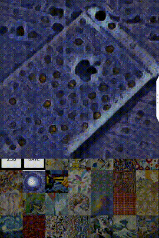
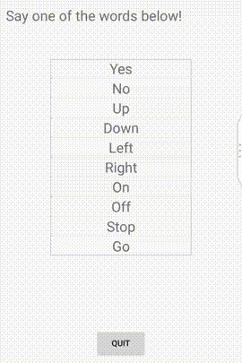

## Tensorflow Lite


官方文档地址：[Building Mobile Apps with TensorFlow](https://www.tensorflow.org/mobile/)

----

官方文档一开始就讲：这是一个针对拥有可以在PC端正常工作的TF模型的开发者的教程。所以说明了，手机端是不支持训练模型的，只能使用训练好的模型。当然可以理解，目前手机的性能达不到训练的目的。


### 在移动端使用TF
传统来讲，深度学习运行在数据中心和大型高性能计算机集群，设备要访问一些数据，就要通过网络去获取，这个过程会产生很大的耗费，而且没有网络的话，你的设备就无法工作，这并不理想，所以就需要可以在设备中运行的深度学习框架。

目前，深度学习在移动设备上比较常见的应用是：语音识别，图像识别，物品定位(增强现实)，手势识别，光学字符识别(这个在谷歌翻译的APP已经使用，效果就是相机放在要翻译的字前，相机会自动把这些字替换成目标语言显示，很cool)，翻译，文字分类(适用于输入联想提示)，语音合成等等。

前面提到，移动端虽然可以在没有网络的情况下做一些有限的计算，但更准确的结果还是要交给服务器去处理，所以网络交互的部分依然重要。


> 这部分的重要内容不多，在介绍中，官方给出了一些示例链接，推荐看一看：
> [Tensorflow for Poets](https://codelabs.developers.google.com/codelabs/tensorflow-for-poets/index.html#0)
> [Tensorflow for Poets 2: Optimize for Mobile ](https://codelabs.developers.google.com/codelabs/tensorflow-for-poets-2/index.html#0)
> [Android Camera物体检测](https://github.com/tensorflow/tensorflow/tree/master/tensorflow/examples/android)
> [MNIST For ML Beginners](https://www.tensorflow.org/get_started/mnist/beginners)官方TF教程Demo。MNIST字体识别也是各类教程的入门，所以很推荐。
> [谷歌提供的使用TF做出来的各种模型](https://github.com/tensorflow/models/)
> [DeepMind用深度学习生成的听起来非常自然的语音](https://deepmind.com/blog/wavenet-generative-model-raw-audio/)

### 在Android中编译Tensorflow
编译Android的TF有两种方式，一个是用AndroidStudio，这个是最简单的方式，推荐这种。另一个是用Bazel编译，ADB部署APK的方式。Bazel也建议用用试试，因为下载下来的TF有些运行选项是没有打开的，有时运行TF的时候就会有Log提示XX选项没有打开，打开后速度可以更快，这种情况就需要下载TF源码，用Bazel重新编译。

操作步骤：
* 克隆Tensorflow源码：`git clone https://github.com/tensorflow/tensorflow`
* 用AndroidStudio打开`tensorflow/examples/android`目录
* 打开`build.gradle`，做如下修改
```gradle
// set to 'bazel', 'cmake', 'makefile', 'none'
def nativeBuildSystem = 'none'
```
* 连接设备，运行程序。
	这里运行程序时AndroidStudio在终端打印如下log
	Error: Failure publishing analytics, unable to connect to server
	Error: Connection timed out (Connection timed out)
    然后就会卡在building gradle不动..最简单的解决方案就是打开VPN..


> 上面是打开官方给的应用程序，如果给你自己的应用添加TF，只要在Gradle添加以下代码即可
```gradle
allprojects {
    repositories {
        jcenter()
    }
}
dependencies {
    compile 'org.tensorflow:tensorflow-android:+'
}
```
> 另外也可以手动去网站下载`libandroid_tensorflow_inference_java.jar`或者从源码编译jar

上面的示例会有4个demo
1. TF Classify，使用Inception v3模型给图片做标记，这个就是SNPE用到的Demo.

2. TF Detect，这个功能有个问题，github上已经有相关[issue](https://github.com/tensorflow/tensorflow/issues/12431)

3. TF Stylize

4. TF Speech



因为Android用Java写的，Tensorflow内核是C++，TF有一个JNI库做接口。这个接口只做推理(inference)的作用，所以它支持加载图(graph)，设置输入和运行模型计算特定输出。相关代码在[TensorFlowInferenceInterface.java](https://github.com/tensorflow/tensorflow/blob/r1.4/tensorflow/contrib/android/java/org/tensorflow/contrib/android/TensorFlowInferenceInterface.java)

> 这里inference，graph都是Tensorflow的术语

前面在操作步骤最后提到了往自己的应用中集成的方法，推荐gradle中直接添加，然后就可以直接在Android代码中使用TF。
官方教程还提到了TF的设计是模块化，模块之间相互独立，介绍了C++部分是如何设计独立模块的调用，以及protobufs版本不一致可能带来的问题及解决。这部分我目前还没有看到对我使用Tensorflow有什么影响，所以这部分内容看看[文档](https://www.tensorflow.org/mobile/linking_libs#calling_the_tensorflow_api)了解一下，后面用到了再串起来。

后面还有一部分介绍TF中间生成Model，Graph等和性能优化的问题，这部分我感觉介绍概念的东西很多，因为前面给出了很多例子，所以我打算从例子入手，一步步把一个Demo做出来，然后把概念映射到Demo的每一步去加深记忆。


### Demo-[Tensorflow for Poets](https://codelabs.developers.google.com/codelabs/tensorflow-for-poets/index.html#0)
#### 介绍
这个Demo会做一个transfer learning，就是借助一个训练好的模型对一个类似问题进行重新训练。这个好处在于，深度学习训练模型可能要好几天，但转移学习只要一小会儿时间。
Demo要用到的模型是在ImageNet Large Visual Recognition Challenge数据集上训练的，这些模型可以区分1000种类别。这里我可以为速度，大小，准确率选择合适的权重来最终决定模型架构。

#### 环境
电脑上安装Tensorflow
克隆仓库
```bash
git clone https://github.com/googlecodelabs/tensorflow-for-poets-2
cd tensorflow-for-poets-2
```

TBC