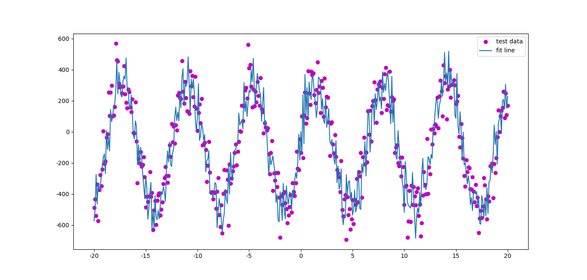

设计了一些形状的点，用Tensorflow生成拟合曲线

###sin形状

```python
hidden_dim = 400
x = tf.placeholder(tf.float32, [1, hidden_dim + 1])
y = 400 * np.sin(x)
```
生成的图形是一个sin分布的点，然后对其进行曲线拟合：


看这张图发现什么问题没有？
我们需要做拟合，是在一堆离散的点中找出一条最合适的平滑曲线，让它尽可能穿过更多的点。而这张图的数据点并不是离散的，而是近乎连续的。所以很容易找到一条，而且是唯一的一条曲线，可以完美穿过所有点。


模型使用最简单的

```python
y = W*x+b
```

调参数：

```python
w4 = weight_variable([1])  # 1
b4 = bias_variable([1])  # 1*1
y = w4 * x + b4
```

选择`W`为[1x1]矩阵，`b`也为[1x1]矩阵，可以想象，运行结果为一条直线


调整`b`的形状为[1x401]，发现结果拟合了

```python
w4 = weight_variable([1])
b4 = bias_variable([1, hidden_dim + 1])  # 1*401
y = w4 * x + b4
```


把`W`的形状调整为[401x401]，把`b`调成[1x1]，发现生成的曲线也能拟合。

```python
w4 = weight_variable([hidden_dim + 1, hidden_dim + 1])  # 401*401
b4 = bias_variable([1])  # 1*401
y = tf.matmul(x, w4) + b4
```




现在有个问题：曲线是哪里来的？
按照之前的理解，我们的y是Wx+b，训练的时候是把训练集里的点一个一个带入，不断地计算W和b。
但这个理解有个问题，就是当我放第一个点进去的时候，经过这个点有无限条线。所以不能一个一个放进去算，而是要大量的点放进去，让这条线**同时**满足这些点，当然因为不可能满足所有点，所以训练的目的是尽可能地满足多个点，这也是为什么要一次放入一组训练数据，而不是一个一个带进去算。

那也解释了，如果W和b是单一的一个未知数，我们去计算
y = W*x+b,知道xy，求w，b,算两个数字需要两个参数就够了。

再复杂点，比如有两个w1w2,

y = W1*x + W2*x + b

