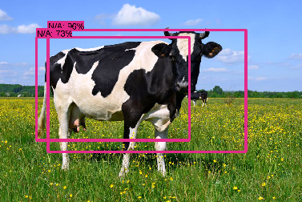

### 使用SSD-MobileNet训练模型

因为Android Demo里的模型是已经训练好的，模型保存的label都是固定的，所以我们在使用的时候会发现还有很多东西它识别不出来。那么我们就需要用它来训练我们自己的数据。下面就是使用SSD-MobileNet训练模型的方法。

#### 下载

* 到Github上下载/克隆[TensorModels](https://github.com/tensorflow/models)，后面的操作都要在这个目录下执行
* 下载数据集(数据集应该是自己制作的，制作数据集需要用到一些工具，另外介绍)，我们使用[VOC2012](http://cvlab.postech.ac.kr/~mooyeol/pascal_voc_2012/VOCtrainval_11-May-2012.tar)数据集
* 下载[SSD-MobileNet](http://download.tensorflow.org/models/object_detection/ssd_mobilenet_v1_coco_11_06_2017.tar.gz)，我们做得，相当于在这个基础上进行再次训练(retrain)

#### 环境设置
进入下载的Model目录：

```bash
cd models/research/
# 执行
protoc object_detection/protos/*.proto --python_out=.
export PYTHONPATH="${PYTHONPATH}:/home/wow/Github/models:/home/wow/Github/models/research/slim/"
```

> 这里的`PYTHONPATH`路径一定要填对，不然会影响到后面运行代码。
> 然后还要注意代码版本不同文件路径有差别，所以要对照自己目录看好。

继续在`research/`目录下执行：

```bash
# 如果找不到setup.py， 用find命令找对应的路径
python setup.py build
python setup.py install
```

#### 配置及训练
在`object_detection/`目录下创建目录`ssd_model`

```bash
mkdir object_detection/ssd_model
```

把下载好的数据集解压进去，数据集路径为
```bash
./object_detection/ssd_model/VOCdevkit/
```

执行配置文件

```bash
python ./object_detection/dataset_tools/create_pascal_tf_record.py --label_map_path=object_detection/data/pascal_label_map.pbtxt --data_dir=object_detection/ssd_model/VOCdevkit/ --year=VOC2012 --set=train --output_path=object_detection/ssd_model/pascal_train.record

python ./object_detection/dataset_tools/create_pascal_tf_record.py --label_map_path=object_detection/data/pascal_label_map.pbtxt --data_dir=object_detection/ssd_model/VOCdevkit/ --year=VOC2012 --set=val --output_path=object_detection/ssd_model/pascal_val.record
```

然后会在`ssd_model/`目录下生成`pascal_train.record`和`pascal_val.record`两个文件，分别有600M左右。
下一步复制训练`pet`数据用到的文件，我们在这个基础上修改配置，训练我们的数据

```Python
cp object_detection/data/pascal_label_map.pbtxt object_detection/ssd_model/
cp object_detection/samples/configs/ssd_mobilenet_v1_pets.config object_detection/ssd_model/
```

我们打开pascal_label_map.pbtxt看一下，这个文件里面是类似Json格式的label集，列出了数据集里有哪些`label`。Pascal这个数据集`label`共有20个。

然后打开配置文件ssd_mobilenet_v1_pets.config，把`num_classes`改为`20`
配置默认训练次数`num_steps: 200000`，我们根据自己需要改，注意这个训练是很慢的，差不多以小时为单位，所以可以适当改小点。

然后改一些文件路径：

```bash
train_input_reader: {
  tf_record_input_reader {
    input_path: "/home/wow/Github/models/research/object_detection/ssd_model/pascal_train.record"
  }
  label_map_path: "/home/wow/Github/models/research/object_detection/ssd_model/pascal_label_map.pbtxt"
}

eval_input_reader: {
  tf_record_input_reader {
    input_path: "/home/wow/Github/models/research/object_detection/ssd_model/pascal_val.record"
  }
  label_map_path: "/home/wow/Github/models/research/object_detection/ssd_model/pascal_label_map.pbtxt"
  shuffle: false
  num_readers: 1
}
```

把之前下载的`ssd_mobilenet`解压到`/object_detection/ssd_model/ssd_mobilenet`下

把路径填进配置文件

```bash
fine_tune_checkpoint: "/home/wow/Github/models/research/object_detection/ssd_model/ssd_mobilenet/model.ckpt"
```
完成之后，就可以训练模型了

```bash
python object_detection/train.py --train_dir object_detection/train --pipeline_config_path object_detection/ssd_model/ssd_mobilenet_v1_pets.config
```

经过漫长的等待，可以看到在`/object_detection/train`目录下生成了模型。然后创建文件夹`ssd_model/model`
```bash
python object_detection/export_inference_graph.py --input_type image_tensor --pipeline_config_path object_detection/ssd_model/ssd_mobilenet_v1_pets.config --trained_checkpoint_prefix object_detection/train/model.ckpt-30000 --output_directory object_detection/ssd_model/model/
```
生成pb文件，再把pascal_label_map.pbtxt的内容改成`.txt`作为label文件，这个模型就可以使用了。

#### 错误解决
错误1：

```bash
TypeError: x and y must have the same dtype, got tf.float32 != tf.int32
```

修改`./object_detection/builders/post_processing_builder.py`

```python
def _score_converter_fn_with_logit_scale(tf_score_converter_fn, logit_scale):
  """Create a function to scale logits then apply a Tensorflow function."""
  def score_converter_fn(logits):
    cr = logit_scale
    cr = tf.constant([[cr]],tf.float32)
    print(logit_scale)
    print(logits)
    scaled_logits = tf.divide(logits, cr, name='scale_logits') #change logit_scale
    return tf_score_converter_fn(scaled_logits, name='convert_scores')
  score_converter_fn.__name__ = '%s_with_logit_scale' % (
      tf_score_converter_fn.__name__)
  return score_converter_fn
```

修改之后，需要再执行：
```bash
python setup.py build
python setup.py install
```


错误2：

```bash
ImportError: cannot import name rewriter_config_pb2
# 或者
AttributeError: 'module' object has no attribute 'mark_flag_as_required'
```

修改：

```bash
# 前一个错
pip install --upgrade tensorflow==1.2.0
# 后一个错
pip install --upgrade tensorflow==1.4.0
```

#### 测试模型

```python
import cv2
import numpy as np
import tensorflow as tf
from object_detection.utils import label_map_util
from object_detection.utils import visualization_utils as vis_util


class TOD(object):
    def __init__(self):
        self.PATH_TO_CKPT = '/home/wow/Github/models/research/object_detection/ssd_model/model/frozen_inference_graph.pb'
        self.PATH_TO_LABELS = '/home/wow/Github/models/research/object_detection/ssd_model/pascal_label_map.pbtxt'
        self.NUM_CLASSES = 1
        self.detection_graph = self._load_model()
        self.category_index = self._load_label_map()

    def _load_model(self):
        detection_graph = tf.Graph()
        with detection_graph.as_default():
            od_graph_def = tf.GraphDef()
            with tf.gfile.GFile(self.PATH_TO_CKPT, 'rb') as fid:
                serialized_graph = fid.read()
                od_graph_def.ParseFromString(serialized_graph)
                tf.import_graph_def(od_graph_def, name='')
        return detection_graph

    def _load_label_map(self):
        label_map = label_map_util.load_labelmap(self.PATH_TO_LABELS)
        categories = label_map_util.convert_label_map_to_categories(label_map,
                                                                    max_num_classes=self.NUM_CLASSES,
                                                                    use_display_name=True)
        category_index = label_map_util.create_category_index(categories)
        return category_index

    def detect(self, image):
        with self.detection_graph.as_default():
            with tf.Session(graph=self.detection_graph) as sess:
                # Expand dimensions since the model expects images to have shape: [1, None, None, 3]
                image_np_expanded = np.expand_dims(image, axis=0)
                image_tensor = self.detection_graph.get_tensor_by_name('image_tensor:0')
                boxes = self.detection_graph.get_tensor_by_name('detection_boxes:0')
                scores = self.detection_graph.get_tensor_by_name('detection_scores:0')
                classes = self.detection_graph.get_tensor_by_name('detection_classes:0')
                num_detections = self.detection_graph.get_tensor_by_name('num_detections:0')
                # Actual detection.
                (boxes, scores, classes, num_detections) = sess.run(
                    [boxes, scores, classes, num_detections],
                    feed_dict={image_tensor: image_np_expanded})
                # Visualization of the results of a detection.
                vis_util.visualize_boxes_and_labels_on_image_array(
                    image,
                    np.squeeze(boxes),
                    np.squeeze(classes).astype(np.int32),
                    np.squeeze(scores),
                    self.category_index,
                    use_normalized_coordinates=True,
                    line_thickness=8)

        cv2.namedWindow("detection", cv2.WINDOW_NORMAL)
        cv2.imshow("detection", image)
        cv2.waitKey(0)

if __name__ == '__main__':
    image = cv2.imread('/home/wow/Github/models/research/object_detection/ssd_model/img/cow-in-pasture.jpg')
    detecotr = TOD()
    detecotr.detect(image)
```

效果：


#### 参考
[深度学习入门篇--手把手教你用 TensorFlow 训练模型](https://cloud.tencent.com/community/article/351424)
[tensorflow ssd mobilenet模型训练](http://blog.csdn.net/u010302327/article/details/78248394)